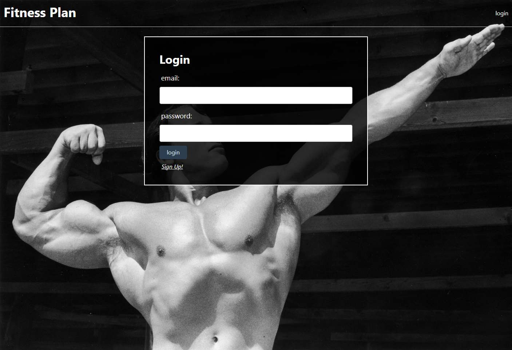

# Fitness Plan

## <section id = "License">License</section>
N/A

## <section id = "Description">Description</section>
This is a lightweight application to store user workout data while giving them the ability to share and compare workouts with others. Whether the motivation is to compete with friends, get new workout ideas, or track progress, all can be done with our Fitness Planner. This application was built using handlebars.js, express sessions, and sequelize. 

## Table of Contents
1.) <a href = "#License">License</a> 
2.) <a href = "#Description">Description</a> 
3.) <a href = "#Installation">Installation</a>  
4.) <a href = "#Usage">Usage</a> 
5.) <a href = "#Contributing">Contributing</a> 
6.) <a href = "#Questions">Questions</a>

## <section id = "Installation">Installation</section>
Command to Install Dependencies: npm i

## <section id = "Usage">Usage</section>
Using the Repo: When first connecting to the application, the user will be presented with the homepage where they can view all registered users' weekly workout's or login/create a user profile. Clicking on the login link will take users' to the login/sign up page and once signed in, they'll be able to create or modify their workouts throughout the week.

Deployed Heroku Application: https://protected-woodland-15218.herokuapp.com/

## <section id = "Contributing">Contributing</section>
Contributing to the Repo: Currently not taking contributions.

## <section id = "Questions">Questions</section>
If you have any questions, please feel free to contact me: Ryan-M-Taylor   
